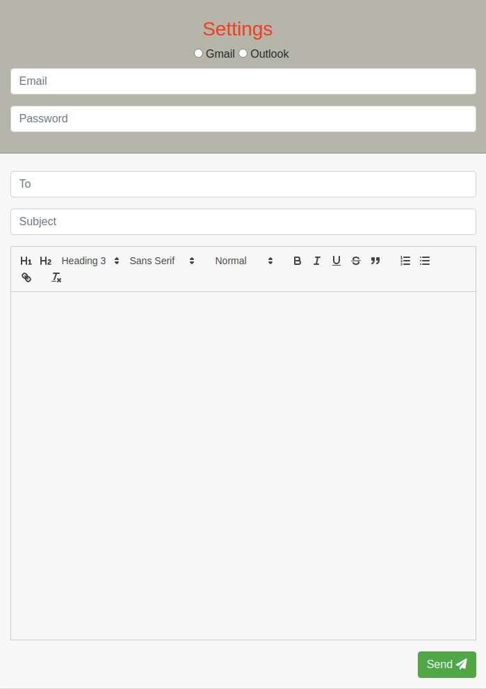

## How to send email on Node.js, with Nodemailer, React & Redux.



### Requirements
#### `Node v 12.16.1`

### Settings For Gmail
##### Go to your google account https://myaccount.google.com/intro/security <br/> - by default this settings is off and you simply turn it on.

### Settings For Outlook
##### Go to your Outlook account https://outlook.live.com/mail/options/mail/accounts <br/> Sync email <br/> - by default this settings is off and you simply turn it on.


Below you will find some information about project structure
### Folder Structure

Project should look like this:

```
email-send-nodemailer-react/
  build/
  node_modules/
  public/
  routes/
  src/
    helpers/   
      envPort.js
      index.js
   public/
     action/
     components/
     hoc/
     reducers/
     App.css
     App.js
     index.js
   index.js
  utils/ 
  README.md
  package.json
  webpack.base.js
  webpack.public.js
  webpack.server.js
```
Below you will find some information on how to perform common tasks.<br>

## Learn More
Learn more from the https://nodemailer.com <br/>
Learn more from the https://reactjs.org <br/>
Learn more from the https://redux.js.org

## How To Run Project

From project directory, you can run:

### `npm run dev`

Runs the app in the development mode.<br>
Open http://localhost:3001 
<br/> to view it in the browser.
